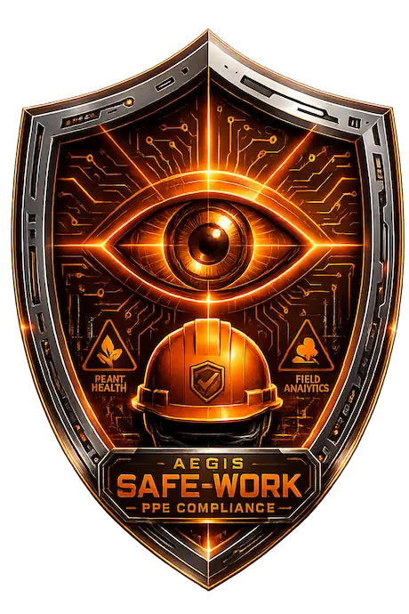

# Aegis-Safe-Work

Industrial workplace safety monitoring system powered by computer vision. Part of the Aegis project portfolio, focused on real-time detection of PPE compliance violations, fire and smoke hazards, and worker fall incidents on industrial and construction sites.

<p align="center">
  
</p>

## Overview

Aegis-Safe-Work combines three independent computer vision models into a unified monitoring pipeline:

1. **Fire/Smoke Detector** — YOLOv8n, two-class detector (fire, smoke), runs client-side in the browser via ONNX.js for low-latency hazard detection without server round-trips.
2. **PPE Compliance Detector** — YOLOv11s, eight-class detector identifying helmet, no-helmet, vest, no-vest, gloves, no-gloves, boots, and person. Runs server-side and provides the person bounding boxes used by the fall detection pipeline.
3. **Fall Detector** — EfficientNet-Lite0 backbone with a temporal attention MLP head, a binary classifier (Normal / Fall) trained on 16-frame video clips. Runs server-side on cropped person regions extracted from the PPE detector output.

The system is designed for multi-worker scenes: rather than analyzing a full video frame, the fall detector operates on a per-person basis, with each detected person box tracked across frames and evaluated independently against a sliding window of 16 frames.

## Architecture

### Detection Pipeline

```
Video Frame
    |
    +--> Fire/Smoke YOLOv8n (client-side, ONNX.js)
    |
    +--> PPE YOLOv11s (server-side)
            |
            +--> Person bounding boxes
                    |
                    +--> Tracker (ByteTrack/SORT-style, per-track ID)
                            |
                            +--> Frame buffer (16-frame sliding window per track)
                                    |
                                    +--> Fall Detector (EfficientNet-Lite0 + Attention MLP)
                                            |
                                            +--> Fall probability per person, per window
```

Each detected person is assigned a persistent track ID. A circular buffer of the last 16 frames is maintained per track ID, letterboxed to 224x224 and ImageNet-normalized to match the training distribution. The fall detector runs inference on this buffer at a configurable interval, not on every frame, to control compute overhead with multiple workers in scene. PPE items (helmet, vest, gloves, boots) are spatially assigned to the nearest person box via IoU-based association, since the PPE detector treats each class independently with no native person-to-item linkage.

### Why per-person cropping

Both training datasets (fall and PPE) consist primarily of single-subject clips. A real industrial scene may contain multiple workers simultaneously, so the fall detector is applied to each cropped person region individually rather than to the full frame. This preserves the data distribution the model was trained on and allows independent fall/no-fall classification per worker.

## Fall Detection Model

### Architecture

EfficientNet-Lite0 (timm, ImageNet pretrained) as a per-frame feature extractor, followed by a temporal attention mechanism and an MLP classifier.

```
Input: (B, 16, 3, 224, 224) float32
  |
  +--> EfficientNet-Lite0 (per-frame, batched)  -> (B, 16, 1280)
  |
  +--> Temporal Attention (Linear -> Tanh -> Linear -> Softmax)  -> (B, 1280)
  |
  +--> MLP Classifier (512 -> 128 -> 1)  -> (B, 1) logit
  |
  +--> Sigmoid  -> probability [0, 1]
```

The temporal attention module learns to weight the 16 sampled frames according to their relevance for fall classification, producing a single attention-weighted feature vector that is passed to the classifier. Attention weights are exposed at inference time for interpretability, allowing visual inspection of which frames in a clip most influenced the prediction.

### Training regime

Two-stage transfer learning, consistent with the approach used across the Aegis project portfolio (Aegis-Sentinel, Aegis-Traffic-Sentinel):

**Stage 1 (epochs 1-5):** EfficientNet-Lite0 backbone fully frozen. Only the temporal attention module and MLP classifier are trained, at a higher learning rate, to reach initial convergence without disturbing ImageNet pretrained weights.

**Stage 2 (epochs 6-25):** The last three inverted residual blocks of the backbone (`blocks[4]`, `blocks[5]`, `blocks[6]`) plus `conv_head` and `bn2` are unfrozen for fine-tuning, using differential learning rates (lower rate for CNN parameters, moderate rate for the MLP/attention head). The first four blocks (`blocks[0]` through `blocks[3]`) remain frozen throughout, preserving low-level ImageNet features given the relatively small dataset size.

Training used AdamW optimizer, cosine annealing learning rate schedule per stage, class-weighted `BCEWithLogitsLoss` to address class imbalance, and early stopping on validation loss (patience of 5 epochs).

### Hyperparameters

| Parameter | Value |
|---|---|
| Frames per clip | 16 |
| Frame sampling | Uniform, `np.linspace` over total video frame count |
| Input resolution | 224 x 224 |
| Preprocessing | Letterbox resize (black padding), ImageNet normalization |
| Batch size | 32 |
| Stage 1 epochs | 5 |
| Stage 1 LR (MLP) | 3e-3 |
| Stage 2 epochs | 20 (max) |
| Stage 2 LR (MLP) | 6e-4 |
| Stage 2 LR (CNN) | 5e-5 |
| Weight decay | 1e-4 |
| Dropout | 0.2 |
| Class weights | Normal: 1.0, Fall: 1.31 |
| Classification threshold | 0.65 |
| Early stopping patience | 5 epochs |

The classification threshold was deliberately set above the conventional 0.5 to reduce false positive alerts in an industrial deployment context, where alert fatigue from frequent false alarms undermines operator trust in the system.

### Dataset

Approximately 2,085 video clips across two classes:

| Class | Source | Count |
|---|---|---|
| Fall | Curated fall clips (real + AI-synthetic) | 822 |
| Fall | Public fall datasets (GMDCSA-24, CAUCAFall) | ~28 |
| Fall | Self-recorded | ~25 |
| Fall | Other (lost to a corrupt source file during ETL) | -1 |
| **Fall total** | | **902** |
| Normal | Self-recorded / collected ADL footage | 167 |
| Normal | CAUCAFall ADL subset | 50 |
| Normal | REAL_LIFE_VIOLENCE noFights subset | 952 |
| **Normal total** | | **1,183** |

The fall class is intentionally weighted lower in the dataset given falls are atypical, low-frequency events in real-world footage, resulting in a class ratio of approximately 1.31:1 (normal:fall). This was compensated during training via class-weighted loss rather than dataset truncation, to preserve maximum training data volume given the limited availability of fall footage relative to normal activity footage.

### Data split

Stratified 90/10 train/validation split, applied independently per class to preserve the class ratio in both sets:

| Split | Fall | Normal | Total |
|---|---|---|---|
| Train | 811 | 1,064 | 1,875 |
| Val | 91 | 119 | 210 |
| **Total** | **902** | **1,183** | **2,085** |

### Results

Final validation metrics (best checkpoint, epoch 11, threshold = 0.65):

| Metric | Value |
|---|---|
| Accuracy | 0.9762 |
| F1 Score | 0.9730 |
| Precision | 0.9574 |
| Recall | 0.9890 |
| Validation Loss | 0.0604 |

Recall was prioritized in the threshold selection given the safety-critical nature of the task: a missed fall (false negative) carries materially higher cost than a false alarm in an industrial monitoring context. At the deployment threshold, the model correctly identified 90 of 91 fall events in the validation set.

### Out-of-distribution testing

The model was additionally evaluated on a held-out set of videos never seen during training or validation, sourced independently from the training distribution. Of 4 fall videos and 5 normal/non-fall videos in this set, the model correctly classified 8 of 9, with zero false positives. The single miss was a distant CCTV clip of a fall in snow, where the subject occupied a small fraction of the frame and recovered quickly post-fall, an out-of-distribution scenario relative to the close-range, person-centered framing of the training data. Given the intended deployment context (cameras positioned to clearly frame industrial workers at close-to-medium range), this failure mode is not representative of expected production conditions.

## ETL Pipeline

Video preprocessing is implemented as a two-stage ETL, executed as standalone Python scripts (not notebooks) on Google Colab with Google Drive mounted.

### Stage 1: Video Standardization

Source videos (mixed `.mp4`/`.avi`, variable resolution, frame rate, and duration) are converted to a standardized format using `ffmpeg` via `subprocess`:

- Resize via letterbox to 224x224 (proportional scale + black padding, aspect ratio preserved)
- Frame rate forced to 30 FPS regardless of source FPS or duration
- Audio stripped (muted output)
- Codec: H.264 (`libx264`)
- Output renamed to `Fall_NNNN.mp4` / `Normal_NNNN.mp4` (zero-padded, sequential)

The script includes resume support (skips already-processed files by output filename) and per-file error handling with timeout protection, allowing recovery from interrupted Colab sessions without reprocessing completed work.

### Stratified Split

Following Stage 1, a stratified 90/10 train/validation split is computed independently per class with a fixed random seed for reproducibility. Due to Google Drive's FUSE mount not supporting POSIX symlinks (`OSError: [Errno 95] Operation not supported`), the split is persisted as a JSON manifest (`split_manifest.json`) rather than via symlinked directory structures, serving as the single source of truth for which videos belong to which split.

### Stage 2: Tensor Conversion

Reading from the Stage 1 output and the split manifest, each video is converted to a training-ready tensor:

- 16 frames sampled uniformly via `np.linspace` over the total frame count
- Frame fallback logic for videos with unreadable frames (duplicates last valid frame)
- ImageNet normalization applied (mean `[0.485, 0.456, 0.406]`, std `[0.229, 0.224, 0.225]`)
- Output stored as `(16, 3, 224, 224)` float16 NumPy arrays (`.npy`)
- A final `manifest.csv` is generated with columns `tensor_path, label, split`, used directly by the PyTorch `Dataset` class during training

This two-stage separation (standardize video, then convert to tensor) mirrors the ETL pattern used across the Aegis project portfolio, allowing the intermediate Stage 1 output to be reused if tensor-level preprocessing parameters change without re-running the more expensive video transcoding step.

## Model Export

The trained PyTorch model is exported to ONNX format for production inference:

- Opset version 17
- Sigmoid activation baked into the exported graph (raw probability output, no post-processing required at inference)
- Dynamic batch axis, supporting both single-person and batched multi-person inference in one forward pass
- Graph-optimized via ONNX Runtime (`ORT_ENABLE_ALL`)
- Final model size: approximately 16.2 MB

Numerical validation against the source PyTorch model showed a maximum absolute difference of `3e-8` between PyTorch and ONNX Runtime outputs, confirming lossless graph conversion.

## Backend Stack

| Component | Technology |
|---|---|
| Language | Python |
| Web framework | FastAPI |
| Inference runtime | ONNX Runtime |
| Computer vision | OpenCV |
| Database | PostgreSQL (async, via `asyncpg` + SQLAlchemy 2.x) |
| Deployment | AWS EC2 (`g4dn.xlarge`), shared instance across the Aegis project portfolio |

The backend exposes a WebSocket streaming endpoint for real-time frame ingestion and inference, alongside REST endpoints for historical alert retrieval and system health checks. PPE compliance and fall detection inference share the same EC2 GPU instance as the other Aegis models, with model loading and batched inference managed to control combined memory and compute footprint.

## Frontend Stack

| Component | Technology |
|---|---|
| Language | TypeScript |
| Framework | React |
| Styling | Tailwind CSS |
| Charts | Recharts |
| Client-side inference | ONNX.js (fire/smoke detection) |

### Design language

The frontend follows an orange cyberpunk HUD console aesthetic, consistent with the visual identity of the broader Aegis project portfolio while using a distinct primary color (orange, reflecting standard industrial safety signage conventions) to differentiate Aegis-Safe-Work from sibling projects such as Aegis-Sentinel. The interface is designed around a live console/dashboard metaphor: real-time detection overlays, attention/confidence readouts, and PPE compliance status per worker, styled with sharp geometric framing, circuit-pattern accents, and high-contrast dark backgrounds.

## Related Projects

Aegis-Safe-Work is part of a six-project portfolio of computer vision systems sharing a common architectural pattern (2D CNN backbone + temporal attention MLP, identical tensor pipeline shape, shared ETL conventions, FastAPI + ONNX Runtime + PostgreSQL backend stack):

- **Aegis-Sentinel** — Violence detection (ResNet50 + Temporal Attention MLP)
- **Aegis-Road-Sentinel** — Automatic number plate recognition
- **Aegis-Traffic-Sentinel** — Vehicle crash detection (MobileNetV2 + Temporal Attention MLP)
- **Aegis-River-Watch** — Flood and river anomaly detection (SegFormer-B2 + RAFT)
- **Aegis-Poultry-Vision** — Poultry farm monitoring
- **Aegis-Safe-Work** — Industrial workplace safety (this project)